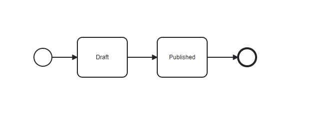

# Item lifecycle

SciCMS Core supports three ways to track (intercept) the lifecycle of Items - hooks, calling custom methods and promotion.
To use the first two, the Item must have an implementation (handler class), which, along with custom methods, implements the interfaces of the necessary hooks.
The handler name is set in the `implementation` field of the Item and is the Kotlin/Java class full name (for example, `ru.scisolutions.customimpl.item.PartItemImpl`).
The handler can be a simple Kotlin/Java class or a Spring bean. In the first case, the kernel will automatically create an instance of it.
A large number of services are available in the bean handler code (such as `ItemService`, `ItemRecDao`, `ACLItemRecDao`, etc.).
Examples of hooks can be found in the packages [ru.scisolutions.customimpl.item](/src/main/kotlin/ru/scisolutions/customimpl/item), [ru.scisolutions.scicmscore.engine.hook](/src/main/kotlin/ru/scisolutions/scicmscore/engine/hook/impl).

## Lifecycle hooks

For each Item lifecycle method, there is a corresponding hook.
Listed below are the Kotlin interfaces and the corresponding methods that Item handlers need to implement.
The handler can implement any number of hooks or none at all.
The kernel will independently call the required method at the time of calling the corresponding API operation on the Item.

### CreateHook

Contains the `beforeCreate` and `afterCreate` methods, which are called for the `create` operation before and after saving a new Item record, respectively.
```kotlin
interface CreateHook {
    /**
     * If this method returns not null, the engine will not create the data.
     */
    fun beforeCreate(itemName: String, input: CreateInput, data: ItemRec): ItemRec?

    fun afterCreate(itemName: String, response: Response)
}
```

The first method takes the name of the Item, the input parameters of the API method, and the record generated for saving.
If the method itself returns a record object, then the kernel will not save it to the database. Otherwise, `null` must be returned.

The second method takes an Item name and a response object that will be returned to the client.

### CreateLocalizationHook

Contains the `beforeCreateLocalization` and `afterCreateLocalization` methods, which are called for the `createLocalization` operation before and after saving a new Item localization, respectively.
The method signature is similar to `CreateHook`, except the return type of the `beforeCreateLocalization` method - `Void`.

```kotlin
interface CreateLocalizationHook {
    fun beforeCreateLocalization(itemName: String, input: CreateLocalizationInput, data: ItemRec)

    fun afterCreateLocalization(itemName: String, response: Response)
}
```

### CreateVersionHook

Contains the `beforeCreateVersion` and `afterCreateVersion` methods, which are called for the `createVersion` operation before and after saving a new version of an Item, respectively.
The method signature is similar to `CreateLocalizationHook`.

```kotlin
interface CreateVersionHook {
    fun beforeCreateVersion(itemName: String, input: CreateVersionInput, data: ItemRec)

    fun afterCreateVersion(itemName: String, response: Response)
}
```

### UpdateHook

Contains the `beforeUpdate` and `afterUpdate` methods, which are called for the `update` operation before and after saving the Item, respectively.
The method signature is similar to `CreateHook`.
```kotlin
interface UpdateHook {
    /**
     * If this method returns not null, the engine will not update the data.
     */
    fun beforeUpdate(itemName: String, input: UpdateInput, data: ItemRec): ItemRec?

    fun afterUpdate(itemName: String, response: Response)
}
```

### DeleteHook

Contains the `beforeDelete` and `afterDelete` methods, which are called for the `delete` operation before and after deleting an Item, respectively.
```kotlin
interface DeleteHook {
    fun beforeDelete(itemName: String, input: DeleteInput, data: ItemRec)

    fun afterDelete(itemName: String, response: Response)
}
```

The first method takes the Item name, the input parameters of the API method, and the record to be deleted.
The second method takes an Item name and a response object that will be returned to the client.

### PurgeHook

Contains `beforePurge` and `afterPurge` methods that are called for the `purge` operation before and after all versions of an Item are deleted, respectively.
The method signature is similar to `DeleteHook`. The third parameter of the `beforePurge` method is the current version of the record to be deleted.
```kotlin
interface PurgeHook {
    fun beforePurge(itemName: String, input: DeleteInput, data: ItemRec)

    fun afterPurge(itemName: String, response: ResponseCollection)
}
```

### LockHook

Contains the `beforeLock`, `afterLock`, `beforeUnlock` and `afterUnlock` methods. The first pair of methods is called for `lock` operations, the second - for `unlock` operations, respectively, before and after locking/unlocking the Item.
```kotlin
interface LockHook {
    fun beforeLock(itemName: String, id: String, data: ItemRec)

    fun afterLock(itemName: String, response: FlaggedResponse)

    fun beforeUnlock(itemName: String, id: String, data: ItemRec)

    fun afterUnlock(itemName: String, response: FlaggedResponse)
}
```

The `beforeLock` and `beforeUnlock` methods accept an Item name, API method input parameters, and the record to be locked/unlocked.
The `afterLock` and `afterUnlock` methods accept an Item name and a response object that will be returned to the client.

### FindOneHook

Contains methods `beforeFindOne` and `afterFindOne`, which are called respectively before and after the operation of obtaining Item data (the operation name corresponds to the Item name).
```kotlin
interface FindOneHook {
    fun beforeFindOne(itemName: String, id: String)

    fun afterFindOne(itemName: String, response: Response)
}
```

The first method takes the Item name and the record ID.
The second method takes an Item name and a response object that will be returned to the client.

### FindAllHook

Contains the `beforeFindAll` and `afterFindAll` methods, which are called for, respectively, before and after the Item search operation (the operation name corresponds to the Item plural name).
```kotlin
interface FindAllHook {
    fun beforeFindAll(itemName: String, input: FindAllInput)

    fun afterFindAll(itemName: String, response: ResponseCollection)
}
```

The first method takes the Item name and the input parameters of the API method.
The second method takes an Item name and a response object that will be returned to the client.

### GenerateIdHook

Contains a single `generateId` method, which is called to generate the Item record identifier in the `create`, `createVersion` and `createLocalization` methods (by default, the format string [UUID](https://en.wikipedia.org/wiki/Universally_unique_identifier) is used as identifiers).

```kotlin
interface GenerateIdHook {
    fun generateId(itemName: String): String
}
```

The method takes the Item name as its only parameter.

## Custom methods

In addition to implementing hook interfaces, an Item handler can have an unlimited number of methods as GraphQL operations.
In a GraphQl schema, these methods will be appended with the Item name (capitalized) as a suffix. Methods must follow certain rules:
- have the `public` modifier;
- do not match reserved names of hook methods;
- accept the `CustomMethodInput` type as the only input parameter;
- the return type must be `CustomMethodResponse`.

The `CustomMethodInput` and `CustomMethodResponse` classes are simple wrappers over the Kotlin `Any?` type (`Object` in Java):

```kotlin
class CustomMethodInput(
    val data: Any? = null
)

class CustomMethodResponse(
    val data: Any? = null
)
```

An example of a custom method can be found in the class [PartItemImpl](/src/main/kotlin/ru/scisolutions/customimpl/item/PartItemImpl.kt).

## Promotion

In addition to implementation, each Item has a `lifecycle` property.
This property contains the record identifier of another Item named `lifecycle`, which is stored in the main database in the `core_lifecycles` table.
This second Item contains a lifecycle specification (a sequence of stages) and an `implementation` field with the handler class full name, which must implement the `Promotable` interface with a single `promote` method:
```kotlin
interface Promotable {
    fun promote(itemName: String, id: String, state: String)
}
```

The method takes the Item name, record identifier, and the string value of the new lifecycle stage.
As with Item handlers, a lifecycle handler can be a simple Kotlin/Java class or a Spring bean.
In the first case, the kernel will automatically create an instance of it. A large number of services are available in the bean handler code.
An example of a handler can be found in the package [ru.scisolutions.customimpl.lifecycle](/src/main/kotlin/ru/scisolutions/customimpl/lifecycle).

The lifecycle specification is an XML string in BPMN notation and can be opened in a compatible editor.
The client application [SciCMS Client](https://github.com/borisblack/scicms-client) uses the library [diagram-js](https://github.com/bpmn-io/diagram-js) for these purposes:



When the `promote` method is executed on a record via the GraphQL API, the lifecycle handler method of the same name is called, which, in turn, can perform any business logic (sending alerts, queuing jobs, writing to the database, etc.).
The value of the new lifecycle stage is stored in the `state` field of the record.

The client application [SciCMS Client](https://github.com/borisblack/scicms-client) provides a convenient user interface for editing lifecycle specifications and performing promotions, as well as many other functions.
