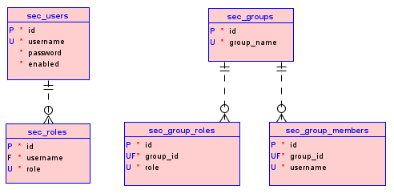
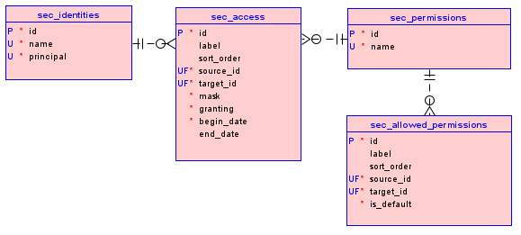

# Security

## Authentication for interacting with the API

### Local authentication

Receiving a token is done through a `POST /api/auth/local` request with the body:
```json
{
  "username": "root",
  "password": "master"
}
```

The user account `root` with the password `master` is created the first time the system starts with full rights.
The response body contains the JWT token and other information about the user:
```json
{
  "jwt": "eyJhbGciOiJIUzUxMiJ9.eyJqdGkiOiJzY2lzb2x1dGlvbnNKV1QiLCJzdWIiOiJyb290IiwiYXV0aG9yaXRpZXMiOlsiUk9MRV9BRE1J...",
  "user": {
    "id": "0c924266-3c61-4362-81d7-9d69403fbe32",
    "username": "root",
    "roles": [
      "ROLE_ADMIN"
    ],
    "authType": "LOCAL"
  },
  "expirationIntervalMillis": 86400000
}
```

**In all subsequent requests** the resulting token must be present in the `Authorization` header: `Authorization: Bearer <jwt>`.

### OAuth2 authentication

To configure OAuth2, we need to specify the provider parameters in the `scicms-core.security.oauth2-providers` block in the file [application.yml](/src/main/resources/application.yml):
```yaml
scicms-core:
  security:
    oauth2-providers:
      - id: my_provider
        name: My Provider
        auth-url: https://my-provider.example.com/auth
        access-token-url: https://my-provider.example.com/token
        api-url: https://my-provider.example.com
        client-id: <my_client_id>
        client-secret: <my_client_secret>
```

Here:
- `id` - arbitrary provider identifier (in Latin letters without spaces);
- `name` - arbitrary name of the provider;
- `auth-url` - address of the provider authentication page (used by the client application);
- `access-token-url` - address for receiving an access token using the access code received from the provider;
- `api-url` - address for receiving the username from the provider using an access token;
- `client-id` - ID of the client application (issued by the provider when registering the application);
- `client-secret` - client application secret (also issued by the provider when registering the application).

After saving your settings and restarting the application, we can sign in.
To do this, we need to obtain an access code from the provider at the address specified in the `auth-url` parameter, followed by redirection and passing the access code as an additional parameter in the URL line.
This procedure, as well as the subsequent steps, have already been implemented in the client application [SciCMS Client](https://github.com/borisblack/scicms-client).
After receiving the access code, we can log in to SciCMS Core using the `POST /api/auth/oauth2` method:
```json
{
  "provider": "my_provider",
  "code": "<access_code>"
}
```

Here `provider` is the provider identifier specified earlier in the parameters, `code` is the access code received from the provider.
The response body is similar to local authentication and contains the JWT token and other information about the user.
The resulting token must be present **in all subsequent requests** in the `Authorization` header: `Authorization: Bearer <jwt>`.

## User management

### Changing password

After the first login, the password can be changed using the `POST /api/auth/local/password` method:
```json
{
  "oldPassword": "<old_password>",
  "newPassword": "<new_password>"
}
```

### Registration a new user

If necessary, we can register a new user by executing the `POST /api/auth/local/register` request:
```json
{
  "username": "<username>",
  "password": "<password>"
}
```

User passwords will be stored in the database in encrypted form and cannot be obtained through an external API.

### Creating a new user as administrator

In general, creating a new user is done via the GraphQL API (at the `/graphql` endpoint):
```
mutation {
  createUser(
    data: {
      username: "my_user"
      password: "my_password"
      enabled: true
    }
  ) {
    data {
        id
    }
  }
}
```

## Roles and groups

Roles can be assigned either directly to a user or to a group.

### Creating a role

To assign a role to a user, we need to run the following GraphQL query. Here the username is passed into the `user` field.
By convention, the role name is written in Latin capital letters with the prefix `ROLE_`.
```
mutation {
  createRole(
    data: {
      user: "my_user"
      role: "ROLE_MANAGER"
    }
  ) {
    data {
      id
    }
  }
}
```

For ease of access control, it is recommended to create user groups (corresponding to their functional responsibilities) and assign roles to these groups.

### Creating a group

Request to create a user group:
```
mutation {
  createGroup(
    data: {
      groupName: "Managers"
    }
  ) {
    data {
      id
    }
  }
}
```

The response will contain the identifier of the created group:
```json
{
  "data": {
    "createGroup": {
      "data": {
        "id": "74ed97ab-8443-4ff7-8b1f-e455c243e0d0"
      }
    }
  }
}
```

### Creating a group role

To assign a role to a newly created group, we need to run a GraphQL query, passing the identifier from the previous response to the `group` field:
```
mutation {
  createGroupRole(
    data: {
      group: "74ed97ab-8443-4ff7-8b1f-e455c243e0d0"
      role: "ROLE_MANAGER"
    }
  ) {
    data {
      id
    }
  }
}
```

### Adding a user to a group

Request to add a user to a group (note that the `user` field here is the username):
```
mutation {
  createGroupMember(
    data: {
      group: "74ed97ab-8443-4ff7-8b1f-e455c243e0d0"
      user: "my_user"
    }
  ) {
    data {
      id
    }
  }
}
```

Thus, after adding a user to the `Managers` group, he will automatically receive all the roles assigned to this group (in this case, one role - `ROLE_MANAGER`).

A simplified database schema (without service attributes) for the Items listed above looks like this:



## Permissions and access

After creating users and assigning them the necessary roles, we can assign them access.
The access control mechanism in SciCMS Core is based on the concept of "permission".
Each Item has a `permission` attribute (the `permission_id` column of the Item table) of type `relation`, which refers to the `permission` Item (the `sec_permissions` table in the main data source).
For more information about Items and attributes, see the [Data Model](data_model.md) section.

The relationship between user/role and permission is made through the `access` Item (the `sec_access` table in the main data source), which has the following attributes:
- `source`, type `relation` - link to the permission;
- `target`, type `relation` - link to user/role (via intermediate Item `identity` - security identity);
- `label`, type `string` - arbitrary access name;
- `beginDate`, type `datetime` - access start date;
- `endDate`, type `datetime` - access expiration date (if not specified, then access is perpetual);
- `mask`, type `int` - access mask, which is an integer from 0 to 31 (5 bits of binary number); each bit of the number means an access type from the set {`A` - Administration, `D` - Delete, `C` - Create, `W` - Write, `R` - Read} from left to right in enumeration order;
- `granting`, type `bool` - a flag that determines whether the permission grants access or, conversely, denies access; denying access has higher priority than allowing access.

The access type `A` allows you to change the value of the `permission` attribute of an Item.
In this case, the selected permission must be included in the list of available permissions for the Item.
Each Item can have a default permission that is used for all new records of that type.
If no default permission is specified, the global default permission `Default Permission` will be used.

## Granting user/group access to a record

Based on the model described above, the process of granting access is as follows.

### 1. Create a permission (if not already created) via the GraphQL API

```
mutation {
  createPermission(
    data: {
      name: "My Permission"
    }
  ) {
    data {
      id
    }
  }
}
```

The response will contain the identifier of the created permission:
```json
{
  "data": {
    "createPermission": {
      "data": {
        "id": "d7c7ea80-2aa1-4592-983e-cbe3af03591c"
      }
    }
  }
}
```

### 2. Create a security identity (if not already created)

In the request, the `name` field must be the name of the role or existing user.
If a username is passed, the `principal` flag must be set to `true`. If the role name is passed - `false`.
```
mutation {
  createIdentity(
    data: {
      name: "my_user"
      principal: true
    }
  ) {
    data {
      id
    }
  }
}
```

The response will contain the identifier of the created identity:
```json
{
  "data": {
    "createIdentity": {
      "data": {
        "id": "208c588e-9e9e-4654-bd3b-debd52892596"
      }
    }
  }
}
```

### 3. Add access

In the request, the `source` and `target` fields must contain the identifiers of the previously created permission and identity, respectively.
```
mutation {
  createAccess(
    data: {
      label: "My Access"
      source: "d7c7ea80-2aa1-4592-983e-cbe3af03591c"
      target: "208c588e-9e9e-4654-bd3b-debd52892596"
      mask: 3
      beginDate: "2024-06-16T00:00:00Z"
      granting: true
    }
  ) {
    data {
      id
    }
  }
}
```

The `mask` field contains the number `3`, which in binary arithmetic corresponds to `00011`, or `write` and `read` operations (see above).

A simplified access control database scheme (without service attributes) for the listed Items looks like this:



To achieve the greatest flexibility in access control, it is recommended to use group roles and assign separate permissions for each (small) functional subsystem (for example, billing department, client managers, sales managers, management, etc.).
Then for each role we can add permissions with the necessary access.
The smaller the functional subsystem, the more flexible and detailed the access settings are.

Similar to any other Items in SciCMS Core, all listed security primitives (users, roles, groups, group roles, group members, permissions, subjects, accesses) have corresponding `read`, `change` and `delete` operations.
For more information about operations, see the [Data Model](data_model.md) section.

The entire described API is also used in the client application [SciCMS Client](https://github.com/borisblack/scicms-client), which provides a convenient user interface for access control, as well as many other functions.